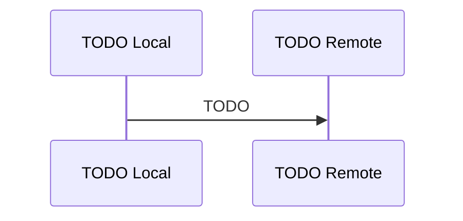

# Sync Architecture

<!-- TOC -->
- [Metadata](#metadata)
- [Purpose](#purpose)
- [Scope](#scope)
- [Dependencies](#dependencies)
- [Related Documents](#related-documents)
- [Definitions](#definitions)
- [Requirements](#requirements)
- [Diagram](#diagram)
- [Open Questions](#open-questions)
- [TODO](#todo)
- [Changelog](#changelog)
<!-- /TOC -->

## Metadata

| Field | Value |
|---|---|
| Title | Sync Architecture |
| Version | 0.1.0 |
| Status | Draft |
| Owner | TODO |
| Last Updated | 2026-06-30 |

## Purpose

TODO

## Scope

- TODO

## Dependencies

| Dependency | Type | Status |
|---|---|---|
| TODO | TODO | TODO |

## Related Documents

- [Offline First](offline-first.md)

## Definitions

| Term | Definition |
|---|---|
| TODO | TODO |

## Requirements

| ID | Requirement | Priority | Status |
|---|---|---|---|
| TODO | TODO | TODO | TODO |

## Diagram

## Open Questions

- TODO

## TODO

- [ ] TODO

## Changelog

| Date | Version | Change |
|---|---|---|
| 2026-06-30 | 0.1.0 | Created architecture document. |
