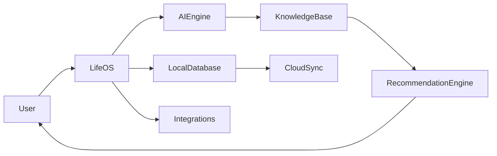
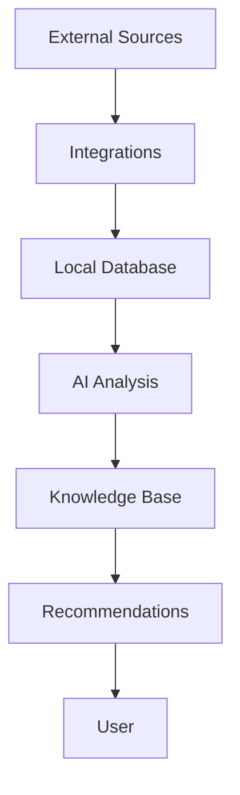

# 00 Overview

<!-- TOC -->
- [Metadata](#metadata)
- [Executive Summary](#executive-summary)
- [System Overview](#system-overview)
- [System Goals](#system-goals)
- [High Level Architecture](#high-level-architecture)
- [Major Components](#major-components)
- [Data Flow Overview](#data-flow-overview)
- [AI Overview](#ai-overview)
- [Storage Overview](#storage-overview)
- [Synchronization Overview](#synchronization-overview)
- [External Integrations](#external-integrations)
- [Supported Platforms](#supported-platforms)
- [System Boundaries](#system-boundaries)
- [Future Expansion](#future-expansion)
- [Related Documents](#related-documents)
- [Open Questions](#open-questions)
- [TODO](#todo)
- [Changelog](#changelog)
<!-- /TOC -->

## Metadata

| Field | Value |
|---|---|
| Title | 00 Overview |
| Version | 0.1.0 |
| Status | Draft |
| Owner | TODO |
| Last Updated | 2026-06-30 |

## Executive Summary

LifeOS is a personal operating system for human life.

At a high level, LifeOS consists of an app, local data storage, AI analysis, integrations, a knowledge base, recommendations, synchronization, and user-facing controls.

This document describes the system at a high level. It MUST NOT define internal implementation details.

## System Overview

LifeOS connects external sources through integrations, stores data locally, analyzes data with AI, builds knowledge, generates recommendations, and returns decision support to the user.

The final decision MUST always belong to the user.

## System Goals

| Goal | Status |
|---|---|
| Explain the major parts of LifeOS | Draft |
| Describe high-level data flow | Draft |
| Describe storage responsibilities | Draft |
| Describe AI responsibilities | Draft |
| Define implementation details | TODO |

## High Level Architecture

## Major Components

| Component | Purpose | Status |
|---|---|---|
| User | Receives decision support and makes the final decision. | Draft |
| LifeOS App | Provides the high-level application surface for LifeOS. | Draft |
| AI Engine | Analyzes data, generates insights, and generates recommendations. | Draft |
| Local Database | Stores user data locally as primary storage. | Draft |
| Cloud Sync | Synchronizes data between devices. | Draft |
| Integrations | Connect external sources to LifeOS. | Draft |
| Knowledge Base | Stores or represents knowledge produced from data. | TODO |
| Recommendation Engine | Generates recommendations for the user. | Draft |
| Timeline | TODO | TODO |
| Settings | TODO | TODO |

## Data Flow Overview

High-level data flow:

1. External Sources
2. Integrations
3. Local Database
4. AI Analysis
5. Knowledge Base
6. Recommendations
7. User

## AI Overview

AI MUST analyze data.

AI MUST generate insights.

AI MUST generate recommendations.

AI MUST NOT own data.

The final decision MUST always belong to the user.

## Storage Overview

Primary storage MUST be local.

Cloud MUST be used only for synchronization.

User MUST own all data.

## Synchronization Overview

Cloud Sync exists only for synchronization.

Implementation details are TODO.

## External Integrations

Integrations connect external sources to LifeOS.

Supported integrations and source-specific behavior are TODO.

## Supported Platforms

| Platform | Status |
|---|---|
| Android | Draft |
| Windows | Draft |
| Future Platforms | TODO |

## System Boundaries

LifeOS:

- is not an operating system for computers;
- is a personal operating system for human life;
- does not replace human decision making;
- does not own user data.

## Future Expansion

TODO

## Related Documents

- [01 Vision](01-vision.md)
- [03 Product Principles](03-product-principles.md)
- [08 AI Brain](08-ai-brain.md)
- [09 Data Sources](09-data-sources.md)
- [10 Knowledge Graph](10-knowledge-graph.md)
- [11 Data Model](11-data-model.md)
- [12 Database](12-database.md)
- [13 Integrations](13-integrations.md)
- [16 Android](16-android.md)
- [17 Windows](17-windows.md)
- [20 Privacy](20-privacy.md)
- [Architecture Overview](../Architecture/architecture-overview.md)
- [System Context](../Architecture/system-context.md)
- [Storage Architecture](../Architecture/storage-architecture.md)
- [Sync Architecture](../Architecture/sync-architecture.md)

## Open Questions

- What are the implementation boundaries of the LifeOS App?
- What is the formal responsibility of Timeline?
- What is the formal responsibility of Settings?
- What are the supported integrations?
- What are the synchronization rules?
- What platforms are included after Android and Windows?

## TODO

- [ ] Define implementation details in architecture documents.
- [ ] Define Timeline.
- [ ] Define Settings.
- [ ] Define integration list and behavior.
- [ ] Define synchronization rules.
- [ ] Define future platforms.

## Changelog

| Date | Version | Change |
|---|---|---|
| 2026-06-30 | 0.1.0 | Created PRD document. |
| 2026-06-30 | 0.1.0 | Moved system overview content from duplicate document. |
