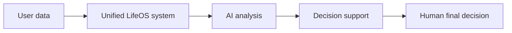
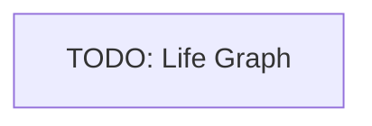
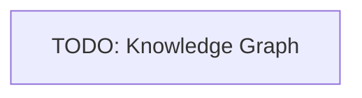
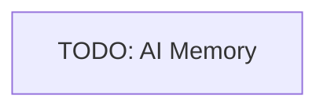

# 03 Product Principles

<!-- TOC -->
- [Metadata](#metadata)
- [Executive Summary](#executive-summary)
- [What is LifeOS](#what-is-lifeos)
- [What LifeOS is NOT](#what-lifeos-is-not)
- [The Core Idea](#the-core-idea)
- [The Digital Twin](#the-digital-twin)
- [Life Graph](#life-graph)
- [Knowledge Graph](#knowledge-graph)
- [AI Memory](#ai-memory)
- [Sources of Truth](#sources-of-truth)
- [Core Objects](#core-objects)
- [Fundamental Principles](#fundamental-principles)
- [Design Rules](#design-rules)
- [Assumptions](#assumptions)
- [Constraints](#constraints)
- [Related Documents](#related-documents)
- [Open Questions](#open-questions)
- [TODO](#todo)
- [Changelog](#changelog)
<!-- /TOC -->

## Metadata

| Field | Value |
|---|---|
| Title | 03 Product Principles |
| Version | 0.1.0 |
| Status | Draft |
| Owner | TODO |
| Last Updated | 2026-06-30 |

## Executive Summary

LifeOS is a personal operating system for human life.

Its core goal is to become a digital copy of the user by gradually collecting as much data as possible, unifying that data into one system, and using AI to analyze the user's full life history.

LifeOS helps the user make decisions. The final decision MUST always remain with the human.

## What is LifeOS

LifeOS is a personal operating system for human life.

LifeOS MUST:

- gradually collect as much user data as possible;
- unify all data into a single system;
- use AI to analyze the user's life history;
- help the user make decisions;
- preserve human decision authority;
- treat user data as belonging to the user;
- prioritize a Local First architecture.

## What LifeOS is NOT

LifeOS MUST NOT be defined as:

| Not LifeOS | Status |
|---|---|
| Habit tracker | Explicit non-goal |
| RPG | Explicit non-goal |
| Chat bot | Explicit non-goal |
| Calendar | Explicit non-goal |
| Note-taking app | Explicit non-goal |

## The Core Idea

The core idea of LifeOS is to create a digital copy of the user.

This requires a system that:

- collects as much life data as possible over time;
- combines that data into one unified structure;
- remembers practically everything;
- allows AI to analyze the full life history;
- supports better decisions without replacing the human decision-maker.

## The Digital Twin

The digital twin is the target representation of the user inside LifeOS.

Based on the current source material, the digital twin SHOULD be understood as a progressively built digital copy of the user created from collected and unified life data.

The formal definition, boundaries, data requirements, and correctness criteria for the digital twin are TODO.

## Life Graph

Life Graph is a future concept for representing the user's life inside LifeOS.

TODO

## Knowledge Graph

TODO

## AI Memory

TODO

## Sources of Truth

| Source of Data | Owner | Priority | TODO |
|---|---|---|---|
| User data | User | High | TODO |
| Local storage | User | High | TODO |
| Cloud synchronization | TODO | Medium | TODO |

## Core Objects

| Object | Description | TODO |
|---|---|---|
| TODO | TODO | TODO |

## Fundamental Principles

| Principle | Requirement |
|---|---|
| Human authority | The final decision MUST always remain with the human. |
| User data ownership | All data MUST belong to the user. |
| Local First | The architecture MUST prioritize local storage. |
| Cloud sync only | Cloud infrastructure MAY be used only for synchronization. |
| Expanding data sources | The number of data sources SHOULD constantly increase. |
| Persistent memory | LifeOS SHOULD remember practically everything. |

## Design Rules

TODO

## Assumptions

| Assumption | Status |
|---|---|
| LifeOS will collect as much data as possible over time. | Draft |
| LifeOS will unify collected data into one system. | Draft |
| AI will analyze the user's full life history. | Draft |
| Cloud will be used only for synchronization. | Draft |

## Constraints

| Constraint | Requirement |
|---|---|
| Human decision-making | LifeOS MUST NOT make the final decision instead of the user. |
| Data ownership | User data MUST belong to the user. |
| Architecture | LifeOS MUST prioritize Local First architecture. |
| Cloud role | Cloud MUST be limited to synchronization unless future approved documentation changes this constraint. |

## Related Documents

- [00 Overview](00-overview.md)
- [01 Vision](01-vision.md)
- [08 AI Brain](08-ai-brain.md)
- [09 Data Sources](09-data-sources.md)
- [10 Knowledge Graph](10-knowledge-graph.md)
- [11 Data Model](11-data-model.md)
- [13 Integrations](13-integrations.md)
- [20 Privacy](20-privacy.md)
- [AI Memory System](../AI/memory-system.md)
- [AI Knowledge Graph](../AI/knowledge-graph.md)
- [Offline First](../Architecture/offline-first.md)
- [Sync Architecture](../Architecture/sync-architecture.md)

## Open Questions

- What is the formal definition of the digital twin?
- What is the relationship between Life Graph and Knowledge Graph?
- What is the scope of AI Memory?
- Which data sources are authoritative?
- How should source priority be calculated?
- What are the first core objects in the system?
- What design rules follow from the core concepts?

## TODO

- [ ] Define Life Graph.
- [ ] Define Knowledge Graph.
- [ ] Define AI Memory.
- [ ] Define core objects.
- [ ] Define source priority model.
- [ ] Define design rules.

## Changelog

| Date | Version | Change |
|---|---|---|
| 2026-06-30 | 0.1.0 | Created PRD document. |
| 2026-06-30 | 0.1.0 | Moved core concepts content from duplicate document. |
