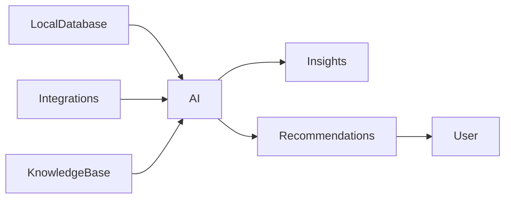

# 08 AI Brain

<!-- TOC -->
- [Metadata](#metadata)
- [Purpose](#purpose)
- [Scope](#scope)
- [Dependencies](#dependencies)
- [Related Documents](#related-documents)
- [Definitions](#definitions)
- [Requirements](#requirements)
- [Content](#content)
- [Open Questions](#open-questions)
- [TODO](#todo)
- [Changelog](#changelog)
<!-- /TOC -->

## Metadata

| Field | Value |
|---|---|
| Title | 08 AI Brain |
| Version | 0.2.0 |
| Status | Draft |
| Owner | TODO |
| Last Updated | 2026-06-30 |

## Purpose

AI analyzes user data.

AI discovers patterns.

AI generates insights.

AI generates recommendations.

AI helps the user understand their life.

AI never makes the final decision.

## Scope

- AI responsibilities.
- AI limitations.
- AI inputs.
- AI outputs.
- Decision model.
- Explainability.
- Privacy.

## Dependencies

| Dependency | Type | Status |
|---|---|---|
| Local Database | Input | Draft |
| Connected Integrations | Input | Draft |
| Knowledge Base | Input | Draft |
| Insights | Output | Draft |
| Recommendations | Output | Draft |
| Explanations | Output | Draft |

## Related Documents

- [AI Memory System](../AI/memory-system.md)
- [01 Vision](01-vision.md)
- [03 Product Principles](03-product-principles.md)
- [06 Functional Requirements](06-functional-requirements.md)
- [07 Non Functional Requirements](07-non-functional-requirements.md)
- [09 Data Sources](09-data-sources.md)
- [10 Knowledge Graph](10-knowledge-graph.md)
- [11 Data Model](11-data-model.md)
- [12 Database](12-database.md)
- [13 Integrations](13-integrations.md)
- [20 Privacy](20-privacy.md)
- [AI Pipeline](../Architecture/ai-pipeline.md)
- [Knowledge Graph](../AI/knowledge-graph.md)
- [Recommendation Engine](../AI/recommendation-engine.md)

## Definitions

| Term | Definition |
|---|---|
| AI | TODO |
| Insight | TODO |
| Recommendation | TODO |
| Explanation | TODO |
| Knowledge Base | TODO |

## Requirements

| ID | Requirement | Priority | Status |
|---|---|---|---|
| AI-001 | AI MUST analyze collected data. | High | Draft |
| AI-002 | AI MUST detect long-term patterns. | High | Draft |
| AI-003 | AI MUST connect related events. | High | Draft |
| AI-004 | AI MUST generate insights. | High | Draft |
| AI-005 | AI MUST generate recommendations. | High | Draft |
| AI-006 | AI MUST explain recommendations. | High | Draft |
| AI-007 | AI MUST NOT own user data. | High | Draft |
| AI-008 | AI MUST NOT make final decisions. | High | Draft |
| AI-009 | AI MUST NOT replace the user. | High | Draft |
| AI-010 | AI MUST only use available data. | High | Draft |
| AI-011 | Every recommendation SHOULD include an explanation. | High | Draft |
| AI-012 | The user MUST remain the owner of all data. | High | Draft |

## Content

### AI Brain

#### Responsibilities

| Responsibility | Requirement |
|---|---|
| Analyze collected data | AI MUST analyze collected data. |
| Detect long-term patterns | AI MUST detect long-term patterns. |
| Connect related events | AI MUST connect related events. |
| Generate insights | AI MUST generate insights. |
| Generate recommendations | AI MUST generate recommendations. |
| Explain recommendations | AI MUST explain recommendations. |

#### Limitations

| Limitation | Requirement |
|---|---|
| Data ownership | AI MUST NOT own user data. |
| Final decisions | AI MUST NOT make final decisions. |
| User replacement | AI MUST NOT replace the user. |
| Data availability | AI MUST only use available data. |

#### Inputs

| Input | Status |
|---|---|
| Local Database | Draft |
| Connected Integrations | Draft |
| Knowledge Base | Draft |

#### Outputs

| Output | Status |
|---|---|
| Insights | Draft |
| Recommendations | Draft |
| Explanations | Draft |

#### Flow

#### Decision Model

AI proposes.

User decides.

#### Explainability

Every recommendation SHOULD include an explanation.

#### Privacy

AI processes user data.

User remains the owner of all data.

## Open Questions

- What is the formal definition of insight?
- What is the formal definition of recommendation?
- What is the formal definition of explanation?
- What data is considered available data?
- How should recommendation explanations be verified?

## TODO

- [ ] Define AI.
- [ ] Define insight.
- [ ] Define recommendation.
- [ ] Define explanation.
- [ ] Define knowledge base.
- [ ] Define available data.
- [ ] Define explainability verification.

## Changelog

| Date | Version | Change |
|---|---|---|
| 2026-06-30 | 0.1.0 | Created PRD document. |
| 2026-06-30 | 0.2.0 | Filled AI Brain from Task 010 source material. |
