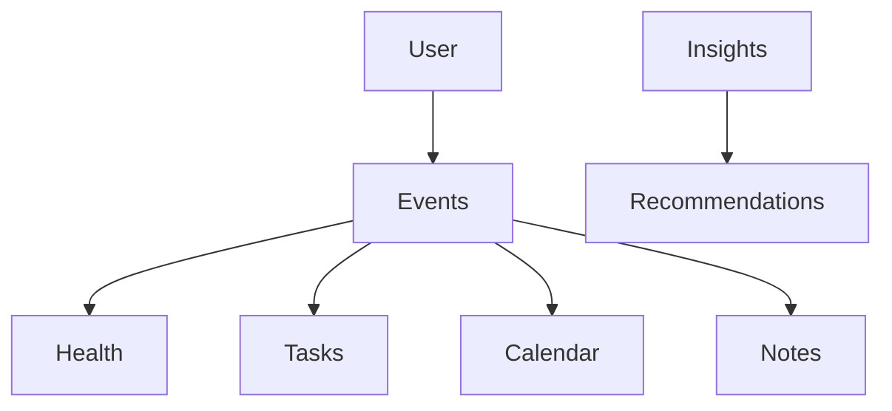

# 10 Knowledge Graph

<!-- TOC -->
- [Metadata](#metadata)
- [Purpose](#purpose)
- [Scope](#scope)
- [Dependencies](#dependencies)
- [Related Documents](#related-documents)
- [Definitions](#definitions)
- [Requirements](#requirements)
- [Content](#content)
- [Open Questions](#open-questions)
- [TODO](#todo)
- [Changelog](#changelog)
<!-- /TOC -->

## Metadata

| Field | Value |
|---|---|
| Title | 10 Knowledge Graph |
| Version | 0.2.0 |
| Status | Draft |
| Owner | TODO |
| Last Updated | 2026-06-30 |

## Purpose

Knowledge Graph stores relationships between collected information.

It allows AI to understand connections instead of isolated facts.

## Scope

- Planned nodes.
- Planned relationships.
- AI usage.
- Knowledge Graph principles.

## Dependencies

| Dependency | Type | Status |
|---|---|---|
| Collected data | Data dependency | Draft |
| AI analysis | System dependency | Draft |
| Insights | Graph node | Planned |
| Recommendations | Graph node | Planned |

## Related Documents

- [AI Knowledge Graph](../AI/knowledge-graph.md)
- [01 Vision](01-vision.md)
- [03 Product Principles](03-product-principles.md)
- [08 AI Brain](08-ai-brain.md)
- [09 Data Sources](09-data-sources.md)
- [11 Data Model](11-data-model.md)
- [12 Database](12-database.md)
- [20 Privacy](20-privacy.md)

## Definitions

| Term | Definition |
|---|---|
| Knowledge Graph | Stores relationships between collected information. |
| Node | TODO |
| Relationship | TODO |
| Insight | TODO |
| Recommendation | TODO |

## Requirements

| ID | Requirement | Priority | Status |
|---|---|---|---|
| KG-001 | Knowledge Graph MUST store relationships between collected information. | High | Draft |
| KG-002 | Knowledge Graph MUST allow AI to understand connections instead of isolated facts. | High | Draft |
| KG-003 | Knowledge Graph MUST be based on collected data. | High | Draft |
| KG-004 | Knowledge Graph SHOULD grow over time. | High | Draft |
| KG-005 | Relationships SHOULD be continuously expanded. | High | Draft |
| KG-006 | The user MUST own all graph data. | High | Draft |
| KG-007 | AI MUST analyze the graph. | High | Draft |
| KG-008 | AI MUST search for relationships. | High | Draft |
| KG-009 | AI MUST discover long-term patterns. | High | Draft |
| KG-010 | AI MUST generate insights. | High | Draft |
| KG-011 | AI MUST generate recommendations. | High | Draft |

## Content

### Knowledge Graph

#### Graph Diagram

#### Nodes

| Node | Description | Status |
|---|---|---|
| User | TODO | Planned |
| Events | TODO | Planned |
| Health | TODO | Planned |
| Tasks | TODO | Planned |
| Calendar | TODO | Planned |
| Notes | TODO | Planned |
| Recommendations | TODO | Planned |
| Insights | TODO | Planned |

#### Relationships

| Relationship | Status |
|---|---|
| User -> Events | Planned |
| Events -> Health | Planned |
| Events -> Tasks | Planned |
| Events -> Calendar | Planned |
| Events -> Notes | Planned |
| Insights -> Recommendations | Planned |

#### AI Usage

| AI Usage | Requirement |
|---|---|
| Analyze the graph | AI MUST analyze the graph. |
| Search for relationships | AI MUST search for relationships. |
| Discover long-term patterns | AI MUST discover long-term patterns. |
| Generate insights | AI MUST generate insights. |
| Generate recommendations | AI MUST generate recommendations. |

#### Principles

| Principle | Requirement |
|---|---|
| The graph grows over time. | Knowledge Graph SHOULD grow over time. |
| Relationships are continuously expanded. | Relationships SHOULD be continuously expanded. |
| The graph is based on collected data. | Knowledge Graph MUST be based on collected data. |
| The user owns all graph data. | The user MUST own all graph data. |

## Open Questions

- What is the formal definition of each node?
- What is the formal definition of each relationship?
- How are relationships continuously expanded?
- How does AI discover long-term patterns from the graph?
- How is graph ownership represented?

## TODO

- [ ] Define User node.
- [ ] Define Events node.
- [ ] Define Health node.
- [ ] Define Tasks node.
- [ ] Define Calendar node.
- [ ] Define Notes node.
- [ ] Define Recommendations node.
- [ ] Define Insights node.
- [ ] Define relationship expansion rules.
- [ ] Define graph ownership model.

## Changelog

| Date | Version | Change |
|---|---|---|
| 2026-06-30 | 0.1.0 | Created PRD document. |
| 2026-06-30 | 0.2.0 | Filled Knowledge Graph from Task 012 source material. |
