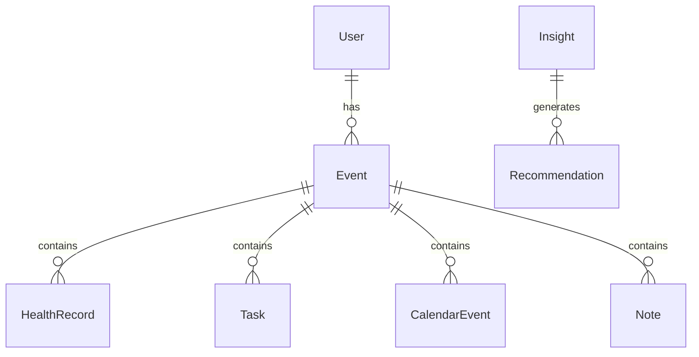

# 11 Data Model

<!-- TOC -->
- [Metadata](#metadata)
- [Purpose](#purpose)
- [Scope](#scope)
- [Dependencies](#dependencies)
- [Related Documents](#related-documents)
- [Definitions](#definitions)
- [Requirements](#requirements)
- [Content](#content)
- [Open Questions](#open-questions)
- [TODO](#todo)
- [Changelog](#changelog)
<!-- /TOC -->

## Metadata

| Field | Value |
|---|---|
| Title | 11 Data Model |
| Version | 0.2.0 |
| Status | Draft |
| Owner | TODO |
| Last Updated | 2026-06-30 |

## Purpose

Define the planned LifeOS data model entities and relationships.

## Scope

- Planned entities.
- Planned relationships.
- ER diagram.
- General data model principles.

## Dependencies

| Dependency | Type | Status |
|---|---|---|
| User | Entity | Planned |
| Event | Entity | Planned |
| Health Record | Entity | Planned |
| Task | Entity | Planned |
| Calendar Event | Entity | Planned |
| Note | Entity | Planned |
| Insight | Entity | Planned |
| Recommendation | Entity | Planned |

## Related Documents

- [01 Vision](01-vision.md)
- [03 Product Principles](03-product-principles.md)
- [08 AI Brain](08-ai-brain.md)
- [09 Data Sources](09-data-sources.md)
- [10 Knowledge Graph](10-knowledge-graph.md)
- [12 Database](12-database.md)
- [20 Privacy](20-privacy.md)
- [Entity List](../Database/entity-list.md)
- [ER Diagram](../Database/er-diagram.md)
- [Relationships](../Database/relationships.md)

## Definitions

| Term | Definition |
|---|---|
| Entity | TODO |
| Relationship | TODO |
| Attribute | TODO |
| Historical Data | TODO |
| Local Storage | TODO |

## Requirements

| ID | Requirement | Priority | Status |
|---|---|---|---|
| DM-001 | The data model MUST include User. | High | Planned |
| DM-002 | The data model MUST include Event. | High | Planned |
| DM-003 | The data model MUST include Health Record. | High | Planned |
| DM-004 | The data model MUST include Task. | High | Planned |
| DM-005 | The data model MUST include Calendar Event. | High | Planned |
| DM-006 | The data model MUST include Note. | High | Planned |
| DM-007 | The data model MUST include Insight. | High | Planned |
| DM-008 | The data model MUST include Recommendation. | High | Planned |
| DM-009 | User MUST own all entities. | High | Draft |
| DM-010 | Historical data MUST be preserved. | High | Draft |
| DM-011 | Relationships MAY expand over time. | High | Draft |
| DM-012 | Local storage MUST be primary. | High | Draft |

## Content

### Data Model

#### Entities

| Entity ID | Name | Purpose | Owner | Status | Attributes |
|---|---|---|---|---|---|
| Entity-001 | User | TODO | User | Planned | TODO |
| Entity-002 | Event | TODO | User | Planned | TODO |
| Entity-003 | Health Record | TODO | User | Planned | TODO |
| Entity-004 | Task | TODO | User | Planned | TODO |
| Entity-005 | Calendar Event | TODO | User | Planned | TODO |
| Entity-006 | Note | TODO | User | Planned | TODO |
| Entity-007 | Insight | TODO | User | Planned | TODO |
| Entity-008 | Recommendation | TODO | User | Planned | TODO |

#### Relationships

| Relationship | Status |
|---|---|
| User -> Event | Planned |
| Event -> Health Record | Planned |
| Event -> Task | Planned |
| Event -> Calendar Event | Planned |
| Event -> Note | Planned |
| Insight -> Recommendation | Planned |

#### ER Diagram

#### General Principles

| Principle | Requirement |
|---|---|
| User owns all entities. | User MUST own all entities. |
| Historical data is preserved. | Historical data MUST be preserved. |
| Relationships may expand over time. | Relationships MAY expand over time. |
| Local storage is primary. | Local storage MUST be primary. |

## Open Questions

- What is the purpose of each entity?
- What attributes belong to each entity?
- How should historical data be preserved?
- How may relationships expand over time?
- How is local primary storage represented in the data model?

## TODO

- [ ] Define purpose for each entity.
- [ ] Define attributes for each entity.
- [ ] Define historical data preservation rules.
- [ ] Define relationship expansion rules.
- [ ] Define local storage representation.

## Changelog

| Date | Version | Change |
|---|---|---|
| 2026-06-30 | 0.1.0 | Created PRD document. |
| 2026-06-30 | 0.2.0 | Filled data model from Task 013 source material. |
