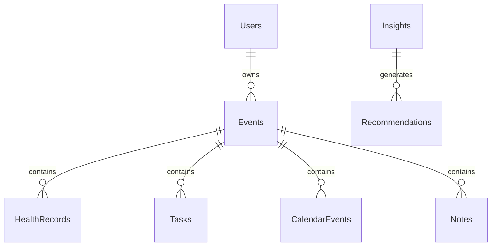

# 12 Database

<!-- TOC -->
- [Metadata](#metadata)
- [Purpose](#purpose)
- [Scope](#scope)
- [Dependencies](#dependencies)
- [Related Documents](#related-documents)
- [Definitions](#definitions)
- [Requirements](#requirements)
- [Content](#content)
- [Open Questions](#open-questions)
- [TODO](#todo)
- [Changelog](#changelog)
<!-- /TOC -->

## Metadata

| Field | Value |
|---|---|
| Title | 12 Database |
| Version | 0.2.0 |
| Status | Draft |
| Owner | TODO |
| Last Updated | 2026-06-30 |

## Purpose

Define the planned database tables and database principles for LifeOS.

## Scope

- Planned database tables.
- Database principles.
- Future changes.
- ER diagram.

## Dependencies

| Dependency | Type | Status |
|---|---|---|
| Users | Database table | Planned |
| Events | Database table | Planned |
| HealthRecords | Database table | Planned |
| Tasks | Database table | Planned |
| CalendarEvents | Database table | Planned |
| Notes | Database table | Planned |
| Insights | Database table | Planned |
| Recommendations | Database table | Planned |

## Related Documents

- [Database](../Database/)
- [11 Data Model](11-data-model.md)
- [10 Knowledge Graph](10-knowledge-graph.md)
- [09 Data Sources](09-data-sources.md)
- [20 Privacy](20-privacy.md)
- [ER Diagram](../Database/er-diagram.md)
- [Entity List](../Database/entity-list.md)
- [Relationships](../Database/relationships.md)

## Definitions

| Term | Definition |
|---|---|
| Database Table | TODO |
| Primary Key | TODO |
| Field | TODO |
| Historical Information | TODO |

## Requirements

| ID | Requirement | Priority | Status |
|---|---|---|---|
| DB-001 | The database MUST include Users. | High | Planned |
| DB-002 | The database MUST include Events. | High | Planned |
| DB-003 | The database MUST include HealthRecords. | High | Planned |
| DB-004 | The database MUST include Tasks. | High | Planned |
| DB-005 | The database MUST include CalendarEvents. | High | Planned |
| DB-006 | The database MUST include Notes. | High | Planned |
| DB-007 | The database MUST include Insights. | High | Planned |
| DB-008 | The database MUST include Recommendations. | High | Planned |
| DB-009 | Local database MUST be the primary database. | High | Draft |
| DB-010 | Historical information MUST be preserved. | High | Draft |
| DB-011 | User MUST own all stored data. | High | Draft |
| DB-012 | Tables MAY expand in future versions. | High | Draft |

## Content

### Database

#### Tables

| Table ID | Table Name | Purpose | Primary Key | Fields | Status |
|---|---|---|---|---|---|
| Table-001 | Users | TODO | TODO | TODO | Planned |
| Table-002 | Events | TODO | TODO | TODO | Planned |
| Table-003 | HealthRecords | TODO | TODO | TODO | Planned |
| Table-004 | Tasks | TODO | TODO | TODO | Planned |
| Table-005 | CalendarEvents | TODO | TODO | TODO | Planned |
| Table-006 | Notes | TODO | TODO | TODO | Planned |
| Table-007 | Insights | TODO | TODO | TODO | Planned |
| Table-008 | Recommendations | TODO | TODO | TODO | Planned |

#### Database Principles

| Principle | Requirement |
|---|---|
| Local database is the primary database. | Local database MUST be the primary database. |
| Historical information is preserved. | Historical information MUST be preserved. |
| User owns all stored data. | User MUST own all stored data. |
| Tables may expand in future versions. | Tables MAY expand in future versions. |

#### ER Diagram

#### Future Changes

TODO

## Open Questions

- What is the purpose of each table?
- What is the primary key for each table?
- What fields belong to each table?
- How is historical information preserved?
- How may tables expand in future versions?

## TODO

- [ ] Define purpose for each table.
- [ ] Define primary key for each table.
- [ ] Define fields for each table.
- [ ] Define historical information preservation rules.
- [ ] Define future table expansion rules.

## Changelog

| Date | Version | Change |
|---|---|---|
| 2026-06-30 | 0.1.0 | Created PRD document. |
| 2026-06-30 | 0.2.0 | Filled database document from Task 014 source material. |
