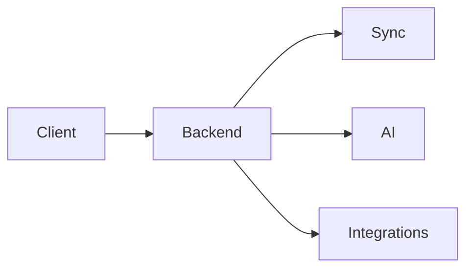

# 15 Backend

<!-- TOC -->
- [Metadata](#metadata)
- [Purpose](#purpose)
- [Scope](#scope)
- [Dependencies](#dependencies)
- [Related Documents](#related-documents)
- [Definitions](#definitions)
- [Requirements](#requirements)
- [Content](#content)
- [Open Questions](#open-questions)
- [TODO](#todo)
- [Changelog](#changelog)
<!-- /TOC -->

## Metadata

| Field | Value |
|---|---|
| Title | 15 Backend |
| Version | 0.2.0 |
| Status | Draft |
| Owner | TODO |
| Last Updated | 2026-06-30 |

## Purpose

Backend coordinates synchronization and AI services.

## Scope

- Synchronization.
- API communication.
- AI requests.
- Integration management.
- Backend principles.

## Dependencies

| Dependency | Type | Status |
|---|---|---|
| Synchronization | Backend responsibility | Draft |
| API communication | Backend responsibility | Draft |
| AI requests | Backend responsibility | Draft |
| Integration management | Backend responsibility | Draft |

## Related Documents

- [Architecture Overview](../Architecture/architecture-overview.md)
- [06 Functional Requirements](06-functional-requirements.md)
- [07 Non Functional Requirements](07-non-functional-requirements.md)
- [08 AI Brain](08-ai-brain.md)
- [13 Integrations](13-integrations.md)
- [20 Privacy](20-privacy.md)
- [Sync Architecture](../Architecture/sync-architecture.md)
- [AI Pipeline](../Architecture/ai-pipeline.md)

## Definitions

| Term | Definition |
|---|---|
| Backend | TODO |
| Synchronization | TODO |
| API Communication | TODO |
| AI Request | TODO |
| Integration Management | TODO |

## Requirements

| ID | Requirement | Priority | Status |
|---|---|---|---|
| BE-001 | Backend MUST coordinate synchronization. | High | Draft |
| BE-002 | Backend MUST coordinate API communication. | High | Draft |
| BE-003 | Backend MUST coordinate AI requests. | High | Draft |
| BE-004 | Backend MUST coordinate integration management. | High | Draft |
| BE-005 | Local database MUST be primary. | High | Draft |
| BE-006 | Backend MUST NOT own user data. | High | Draft |
| BE-007 | Backend MUST support synchronization. | High | Draft |
| BE-008 | Backend MAY evolve over time. | Medium | Draft |

## Content

### Backend

#### Responsibilities

| Responsibility | Status |
|---|---|
| Synchronization | Draft |
| API communication | Draft |
| AI requests | Draft |
| Integration management | Draft |

#### Backend Principles

| Principle | Requirement |
|---|---|
| Local database is primary. | Local database MUST be primary. |
| Backend never owns user data. | Backend MUST NOT own user data. |
| Backend supports synchronization. | Backend MUST support synchronization. |
| Backend may evolve over time. | Backend MAY evolve over time. |

#### Backend Flow

## Open Questions

- What APIs are required?
- What AI requests are supported?
- What synchronization behavior is required?
- What integration management behavior is required?

## TODO

- [ ] Define backend.
- [ ] Define API communication.
- [ ] Define AI requests.
- [ ] Define synchronization behavior.
- [ ] Define integration management behavior.

## Changelog

| Date | Version | Change |
|---|---|---|
| 2026-06-30 | 0.1.0 | Created PRD document. |
| 2026-06-30 | 0.2.0 | Filled backend document from Task 016 source material. |
