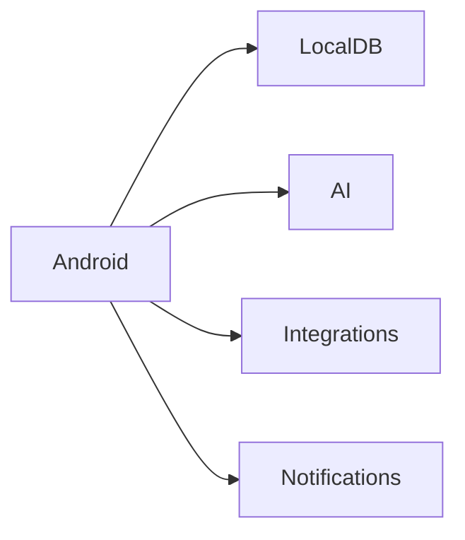

# 16 Android

<!-- TOC -->
- [Metadata](#metadata)
- [Purpose](#purpose)
- [Scope](#scope)
- [Dependencies](#dependencies)
- [Related Documents](#related-documents)
- [Definitions](#definitions)
- [Requirements](#requirements)
- [Content](#content)
- [Open Questions](#open-questions)
- [TODO](#todo)
- [Changelog](#changelog)
<!-- /TOC -->

## Metadata

| Field | Value |
|---|---|
| Title | 16 Android |
| Version | 0.2.0 |
| Status | Draft |
| Owner | TODO |
| Last Updated | 2026-06-30 |

## Purpose

Android is the primary platform.

## Scope

- Local database.
- AI access.
- Health integrations.
- Notifications.
- Background synchronization.
- Android principles.

## Dependencies

| Dependency | Type | Status |
|---|---|---|
| Local database | Android capability | Planned |
| AI access | Android capability | Planned |
| Health integrations | Android capability | Planned |
| Notifications | Android capability | Planned |
| Background synchronization | Android capability | Planned |

## Related Documents

- [Android](../Android/)
- [02 Product Strategy](02-product-strategy.md)
- [06 Functional Requirements](06-functional-requirements.md)
- [07 Non Functional Requirements](07-non-functional-requirements.md)
- [08 AI Brain](08-ai-brain.md)
- [09 Data Sources](09-data-sources.md)
- [13 Integrations](13-integrations.md)
- [25 Notifications](25-notifications.md)

## Definitions

| Term | Definition |
|---|---|
| Android | Primary platform. |
| Local Database | TODO |
| AI Access | TODO |
| Health Integrations | TODO |
| Background Synchronization | TODO |

## Requirements

| ID | Requirement | Priority | Status |
|---|---|---|---|
| AND-001 | Android MUST be the primary platform. | High | Draft |
| AND-002 | Android MUST support local database capability. | High | Planned |
| AND-003 | Android MUST support AI access capability. | High | Planned |
| AND-004 | Android MUST support health integrations capability. | High | Planned |
| AND-005 | Android MUST support notifications capability. | High | Planned |
| AND-006 | Android MUST support background synchronization capability. | High | Planned |
| AND-007 | Android MUST work offline. | High | Draft |
| AND-008 | Android MUST synchronize when possible. | High | Draft |
| AND-009 | User MUST own all data. | High | Draft |
| AND-010 | Android MUST be the first supported platform. | High | Draft |

## Content

### Android

#### Capabilities

| Capability | Status |
|---|---|
| Local database | Planned |
| AI access | Planned |
| Health integrations | Planned |
| Notifications | Planned |
| Background synchronization | Planned |

#### Principles

| Principle | Requirement |
|---|---|
| Android works offline. | Android MUST work offline. |
| Android synchronizes when possible. | Android MUST synchronize when possible. |
| User owns all data. | User MUST own all data. |
| Android is the first supported platform. | Android MUST be the first supported platform. |

#### Android Flow

## Open Questions

- What local database behavior is required on Android?
- What AI access behavior is required on Android?
- What health integrations are required on Android?
- What notification behavior is required on Android?
- What background synchronization behavior is required on Android?

## TODO

- [ ] Define local database behavior on Android.
- [ ] Define AI access behavior on Android.
- [ ] Define health integration behavior on Android.
- [ ] Define notification behavior on Android.
- [ ] Define background synchronization behavior on Android.

## Changelog

| Date | Version | Change |
|---|---|---|
| 2026-06-30 | 0.1.0 | Created PRD document. |
| 2026-06-30 | 0.2.0 | Filled Android document from Task 017 source material. |
