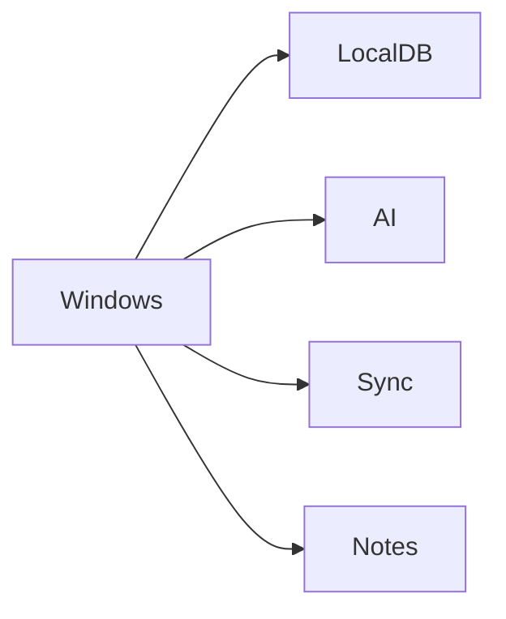

# 17 Windows

<!-- TOC -->
- [Metadata](#metadata)
- [Purpose](#purpose)
- [Scope](#scope)
- [Dependencies](#dependencies)
- [Related Documents](#related-documents)
- [Definitions](#definitions)
- [Requirements](#requirements)
- [Content](#content)
- [Open Questions](#open-questions)
- [TODO](#todo)
- [Changelog](#changelog)
<!-- /TOC -->

## Metadata

| Field | Value |
|---|---|
| Title | 17 Windows |
| Version | 0.2.0 |
| Status | Draft |
| Owner | TODO |
| Last Updated | 2026-06-30 |

## Purpose

Windows is a supported desktop platform for LifeOS.

## Scope

- View life data.
- AI interaction.
- Notes.
- Synchronization.
- Local database.
- Windows principles.

## Dependencies

| Dependency | Type | Status |
|---|---|---|
| Local database | Windows capability | Planned |
| AI interaction | Windows capability | Planned |
| Synchronization | Windows capability | Planned |
| Notes | Windows capability | Planned |

## Related Documents

- [Windows](../Windows/)
- [02 Product Strategy](02-product-strategy.md)
- [06 Functional Requirements](06-functional-requirements.md)
- [07 Non Functional Requirements](07-non-functional-requirements.md)
- [08 AI Brain](08-ai-brain.md)
- [11 Data Model](11-data-model.md)
- [20 Privacy](20-privacy.md)

## Definitions

| Term | Definition |
|---|---|
| Windows | Supported desktop platform for LifeOS. |
| Local First | TODO |
| AI Interaction | TODO |
| Synchronization | TODO |

## Requirements

| ID | Requirement | Priority | Status |
|---|---|---|---|
| WIN-001 | Windows MUST be a supported desktop platform for LifeOS. | High | Draft |
| WIN-002 | Windows MUST support viewing life data. | High | Planned |
| WIN-003 | Windows MUST support AI interaction. | High | Planned |
| WIN-004 | Windows MUST support Notes. | High | Planned |
| WIN-005 | Windows MUST support Synchronization. | High | Planned |
| WIN-006 | Windows MUST support Local database. | High | Planned |
| WIN-007 | Windows MUST support Local First. | High | Draft |
| WIN-008 | Windows MUST synchronize when available. | High | Draft |
| WIN-009 | User MUST own all data. | High | Draft |
| WIN-010 | Windows MUST complement Android. | High | Draft |

## Content

### Windows

#### Capabilities

| Capability | Status |
|---|---|
| View life data | Planned |
| AI interaction | Planned |
| Notes | Planned |
| Synchronization | Planned |
| Local database | Planned |

#### Principles

| Principle | Requirement |
|---|---|
| Windows supports Local First. | Windows MUST support Local First. |
| Windows synchronizes when available. | Windows MUST synchronize when available. |
| User owns all data. | User MUST own all data. |
| Windows complements Android. | Windows MUST complement Android. |

#### Windows Flow

## Open Questions

- What is required for viewing life data on Windows?
- What AI interaction is required on Windows?
- What Notes behavior is required on Windows?
- What synchronization behavior is required on Windows?
- What local database behavior is required on Windows?

## TODO

- [ ] Define view life data behavior on Windows.
- [ ] Define AI interaction behavior on Windows.
- [ ] Define Notes behavior on Windows.
- [ ] Define synchronization behavior on Windows.
- [ ] Define local database behavior on Windows.

## Changelog

| Date | Version | Change |
|---|---|---|
| 2026-06-30 | 0.1.0 | Created PRD document. |
| 2026-06-30 | 0.2.0 | Filled Windows document from Task 018 source material. |
