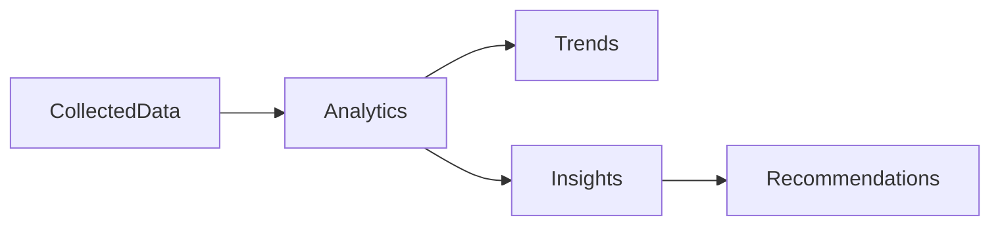

# 21 Analytics

<!-- TOC -->
- [Metadata](#metadata)
- [Purpose](#purpose)
- [Scope](#scope)
- [Dependencies](#dependencies)
- [Related Documents](#related-documents)
- [Definitions](#definitions)
- [Requirements](#requirements)
- [Content](#content)
- [Open Questions](#open-questions)
- [TODO](#todo)
- [Changelog](#changelog)
<!-- /TOC -->

## Metadata

| Field | Value |
|---|---|
| Title | 21 Analytics |
| Version | 0.2.0 |
| Status | Draft |
| Owner | TODO |
| Last Updated | 2026-06-30 |

## Purpose

Analytics helps users understand their lives.

## Scope

- Health analytics.
- Time analytics.
- Tasks analytics.
- Calendar analytics.
- Notes analytics.
- Analytics outputs.
- Analytics principles.

## Dependencies

| Dependency | Type | Status |
|---|---|---|
| Health | Analytics area | Planned |
| Time | Analytics area | Planned |
| Tasks | Analytics area | Planned |
| Calendar | Analytics area | Planned |
| Notes | Analytics area | Planned |
| Collected data | Analytics input | Draft |

## Related Documents

- [09 Data Sources](09-data-sources.md)
- [05 User Stories](05-user-stories.md)
- [06 Functional Requirements](06-functional-requirements.md)
- [08 AI Brain](08-ai-brain.md)
- [10 Knowledge Graph](10-knowledge-graph.md)
- [11 Data Model](11-data-model.md)

## Definitions

| Term | Definition |
|---|---|
| Analytics | TODO |
| Trend | TODO |
| Insight | TODO |
| Recommendation | TODO |

## Requirements

| ID | Requirement | Priority | Status |
|---|---|---|---|
| ANA-001 | Analytics MUST help users understand their lives. | High | Draft |
| ANA-002 | Analytics MUST support Health. | High | Planned |
| ANA-003 | Analytics MUST support Time. | High | Planned |
| ANA-004 | Analytics MUST support Tasks. | High | Planned |
| ANA-005 | Analytics MUST support Calendar. | High | Planned |
| ANA-006 | Analytics MUST support Notes. | High | Planned |
| ANA-007 | Analytics MUST output Trends. | High | Draft |
| ANA-008 | Analytics MUST output Insights. | High | Draft |
| ANA-009 | Analytics MUST output Recommendations. | High | Draft |
| ANA-010 | Analytics MUST be based on collected data. | High | Draft |
| ANA-011 | Analytics MUST NOT replace user decisions. | High | Draft |
| ANA-012 | Analytics SHOULD improve over time. | High | Draft |

## Content

### Analytics

#### Analytics Areas

| Analytics Area | Status |
|---|---|
| Health | Planned |
| Time | Planned |
| Tasks | Planned |
| Calendar | Planned |
| Notes | Planned |

#### Outputs

| Output | Status |
|---|---|
| Trends | Draft |
| Insights | Draft |
| Recommendations | Draft |

#### Principles

| Principle | Requirement |
|---|---|
| Analytics is based on collected data. | Analytics MUST be based on collected data. |
| Analytics does not replace user decisions. | Analytics MUST NOT replace user decisions. |
| Analytics improves over time. | Analytics SHOULD improve over time. |

#### Analytics Flow

## Open Questions

- What defines Health analytics?
- What defines Time analytics?
- What defines Tasks analytics?
- What defines Calendar analytics?
- What defines Notes analytics?
- How does analytics improve over time?

## TODO

- [ ] Define Health analytics.
- [ ] Define Time analytics.
- [ ] Define Tasks analytics.
- [ ] Define Calendar analytics.
- [ ] Define Notes analytics.
- [ ] Define analytics improvement model.

## Changelog

| Date | Version | Change |
|---|---|---|
| 2026-06-30 | 0.1.0 | Created PRD document. |
| 2026-06-30 | 0.2.0 | Filled analytics document from Task 020 source material. |
