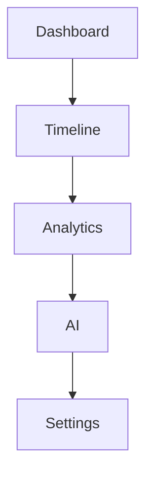

# 22 UX

<!-- TOC -->
- [Metadata](#metadata)
- [Purpose](#purpose)
- [Scope](#scope)
- [Dependencies](#dependencies)
- [Related Documents](#related-documents)
- [Definitions](#definitions)
- [Requirements](#requirements)
- [Content](#content)
- [Open Questions](#open-questions)
- [TODO](#todo)
- [Changelog](#changelog)
<!-- /TOC -->

## Metadata

| Field | Value |
|---|---|
| Title | 22 UX |
| Version | 0.2.0 |
| Status | Draft |
| Owner | TODO |
| Last Updated | 2026-07-01 |

## Purpose

UX should help the user quickly understand their life.

## Scope

- Core UX principles.
- Main screens.
- Navigation.

## Dependencies

| Dependency | Type | Status |
|---|---|---|
| Dashboard | Main screen | Planned |
| Timeline | Main screen | Planned |
| AI | Main screen | Planned |
| Analytics | Main screen | Planned |
| Settings | Main screen | Planned |

## Related Documents

- [Design](../Design/)
- [23 UI](23-ui.md)
- [24 Screens](24-screens.md)
- [21 Analytics](21-analytics.md)
- [08 AI Brain](08-ai-brain.md)

## Definitions

| Term | Definition |
|---|---|
| UX | TODO |
| Low Cognitive Load | TODO |
| Explainable AI | TODO |

## Requirements

| ID | Requirement | Priority | Status |
|---|---|---|---|
| UX-001 | UX MUST help the user quickly understand their life. | High | Draft |
| UX-002 | UX MUST support simplicity. | High | Draft |
| UX-003 | UX MUST support minimalism. | High | Draft |
| UX-004 | UX MUST support fast navigation. | High | Draft |
| UX-005 | UX MUST support explainable AI. | High | Draft |
| UX-006 | UX MUST support consistency. | High | Draft |
| UX-007 | UX MUST support low cognitive load. | High | Draft |

## Content

### UX

#### Core Principles

| Principle | Requirement |
|---|---|
| Simplicity | UX MUST support simplicity. |
| Minimalism | UX MUST support minimalism. |
| Fast navigation | UX MUST support fast navigation. |
| Explainable AI | UX MUST support explainable AI. |
| Consistency | UX MUST support consistency. |
| Low cognitive load | UX MUST support low cognitive load. |

#### Main Screens

| Screen | Status |
|---|---|
| Dashboard | Planned |
| Timeline | Planned |
| AI | Planned |
| Analytics | Planned |
| Settings | Planned |

#### Navigation

## Open Questions

- What are the detailed UX requirements for each main screen?
- What defines fast navigation?
- What defines low cognitive load?
- What UX behavior is required for explainable AI?

## TODO

- [ ] Define detailed UX requirements for Dashboard.
- [ ] Define detailed UX requirements for Timeline.
- [ ] Define detailed UX requirements for Analytics.
- [ ] Define detailed UX requirements for AI.
- [ ] Define detailed UX requirements for Settings.
- [ ] Define fast navigation.
- [ ] Define low cognitive load.
- [ ] Define explainable AI UX behavior.

## Changelog

| Date | Version | Change |
|---|---|---|
| 2026-06-30 | 0.1.0 | Created PRD document. |
| 2026-07-01 | 0.2.0 | Filled UX document from Task 021 source material. |
